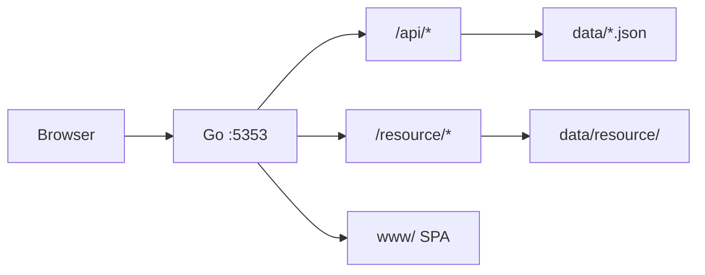

# LumeHub · 光盒

> 收纳影像，寄存私藏

极简的个人影像展示与私有资源托管：单 Go 进程托管 API、静态资源与前端，JSON 文件持久化，**无需数据库**。

| | |
|---|---|
| **当前版本** | [VERSION](VERSION)（[CHANGELOG.md](CHANGELOG.md)） |
| **技术栈** | Go 1.24 · Vue 3 · Vite · Pinia · TypeScript |

## 功能概览

- **画廊**：瀑布流 / 网格布局、图片与视频预览、原图查看、链接复制
- **访问控制**：公开分类、加密分类与查看密钥（`?k=`）、多账号与角色权限
- **登录**：账号密码、Passkey、扫码登录
- **管理**：在线上传（含分片）、条目编辑与排序、分类与布局、存储配额、回收站
- **图片组**：JPG 网页预览 + RAW 等原文件单独下载

## 文档索引

| 文档 | 内容 |
|------|------|
| [Backend/README.md](Backend/README.md) | Go 服务运行、数据目录、REST API、维护脚本 |
| [Frontend/README.md](Frontend/README.md) | 前端开发、构建与目录结构 |
| [Backend/images_README.md](Backend/images_README.md) | 资源目录、命名与 `items.json` 规范（定稿） |
| [Backend/.env.example](Backend/.env.example) | 生产环境变量示例 |
| [Backend/supervisor.example.ini](Backend/supervisor.example.ini) | Supervisor 守护进程示例 |

## 项目结构

```text
LumeHub/
├── README.md
├── CHANGELOG.md
├── VERSION
├── Backend/                 # Go 后端、数据与前端构建产物
│   ├── cmd/lumehub/         # 主服务入口
│   ├── cmd/resourceindex/   # 资源索引工具
│   ├── cmd/vidthumb/        # 视频缩略图工具
│   ├── internal/            # API、存储、认证等
│   ├── scripts/             # 数据校验与迁移（Node.js）
│   ├── data/                # 运行时数据（分类、账号、resource/）
│   ├── www/                 # `pnpm build` 输出目录
│   ├── .env.example
│   └── supervisor.example.ini
└── Frontend/                # Vue 3 源码
    └── src/
```



## 本地开发

需要 **Go 1.24+**、**Node.js** `^20.19` 或 `>=22.12`、**pnpm**。

```bash
# 终端 1：后端（在 Backend 目录）
cd Backend && go run ./cmd/lumehub
# → http://127.0.0.1:5353

# 终端 2：前端热更新（在 Frontend 目录）
cd Frontend && pnpm install && pnpm dev
# → Vite 将 /api、/resource 代理到 :5353
```

一体化预览（接近生产）：在 `Frontend` 执行 `pnpm build` 后，仅启动 Go 服务即可。

## 宝塔部署

Go 进程同时提供 API、静态资源与前端页面，**无需 Nginx 反代**；放行监听端口后直连访问。

### 1. 构建与上传

编译见 [Backend/README.md · 生产构建](Backend/README.md#生产构建)；**上传哪些目录**见 [Backend/README.md · 上传到服务器](Backend/README.md#上传到服务器)。

### 2. 权限

```bash
chmod +x /www/wwwroot/lumehub/lumehub
chown -R www:www /www/wwwroot/lumehub
```

### 3. Supervisor 守护（推荐）

宝塔 → 软件商店 → **Supervisor 管理器** → 添加守护进程，参考 [Backend/supervisor.example.ini](Backend/supervisor.example.ini)：

| 配置项 | 示例值 |
|--------|--------|
| 运行目录 | `/www/wwwroot/lumehub` |
| 启动命令 | `/www/wwwroot/lumehub/lumehub` |
| 环境变量 | `LUMEHUB_ADDR=:5353` |

### 4. 放行端口

宝塔 → **安全** → 放行 **5353**（或与 `LUMEHUB_ADDR` 一致的其他端口）。

访问：`http://<服务器IP>:5353`

### 5. 上线检查清单

- [ ] 修改 `data/accounts.json` 中的默认密码
- [ ] 直连 HTTP 时**不要**设置 `LUMEHUB_COOKIE_SECURE=1`（仅 HTTPS 反代后启用）
- [ ] 定期备份整个 `data/` 目录

### 6. 版本更新

覆盖 `lumehub` 与 `www/`，**保留** `data/`。详见 [Backend/README.md · 版本更新](Backend/README.md#版本更新)。

## 环境变量

完整说明见 [Backend/README.md](Backend/README.md#环境变量) 与 [Backend/.env.example](Backend/.env.example)。

| 变量 | 含义 | 默认 |
|------|------|------|
| `LUMEHUB_ADDR` | 监听地址 | `:5353` |
| `LUMEHUB_DATA` | 数据根目录 | `./data` |
| `LUMEHUB_WWW` | 前端静态目录 | `./www` |
| `LUMEHUB_ROOT` | 工作目录（影响相对路径） | 当前工作目录 |
| `LUMEHUB_PASSWORD` | 单口令兼容（多账号时优先 `accounts.json`） | 空 |
| `LUMEHUB_SESSION_HOURS` | 会话有效小时数 | 内置默认 |
| `LUMEHUB_COOKIE_SECURE` | HTTPS 下 Secure Cookie（`1` / `true`） | 关闭 |
| `LUMEHUB_NO_COLOR` | 关闭启动横幅颜色 | 关闭 |

## 发版前检查

```bash
cd Backend && go test ./...
cd Frontend && pnpm type-check
node Backend/scripts/validate-data.mjs
```

批量整理 `data/` 后另见 [Backend/images_README.md §7](Backend/images_README.md#7-执行与校验必须)。
